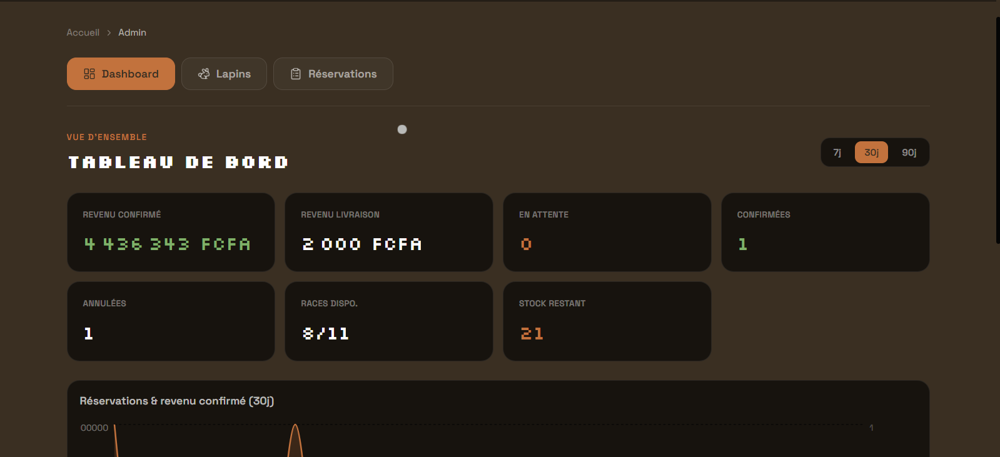
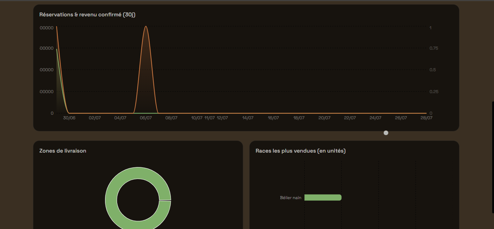
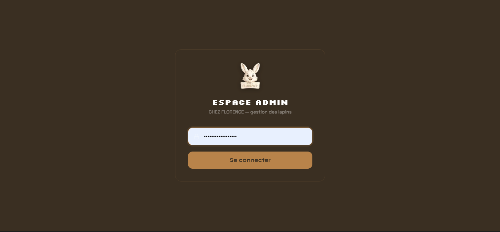
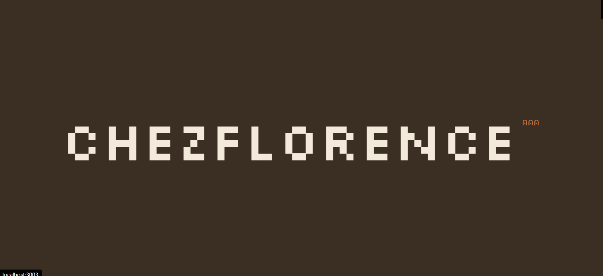
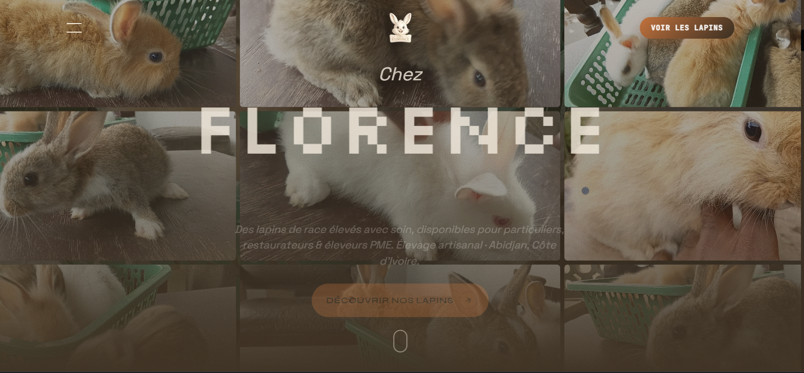
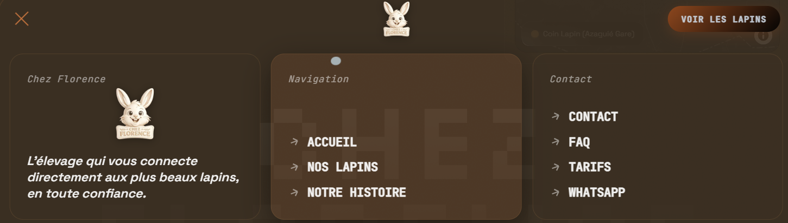
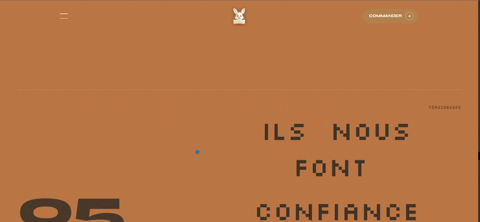
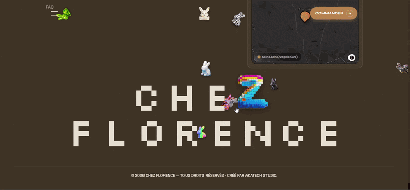

<div align="center">

# 🐇 CHEZ FLORENCE

**Vente & réservation de lapins en ligne** · Stock temps réel · Notification WhatsApp automatique

[](https://chez-florence.vercel.app/)
[](https://akatech.vercel.app/)


</div>

---

CHEZ FLORENCE est une application web complète permettant de présenter des races de lapins, gérer les stocks, recevoir des réservations en ligne et administrer facilement le catalogue depuis un tableau de bord sécurisé. Élevage basé à Azaguié Gare (Côte d'Ivoire) — vente et livraison encadrée sur la région d'Abidjan, commande finalisée par WhatsApp.

## Sommaire

- [Fonctionnalités](#-fonctionnalités)
- [Stack technique](#-stack-technique)
- [Architecture](#-architecture)
- [Installation](#-installation)
- [Variables d'environnement](#️-variables-denvironnement)
- [Développement](#️-développement)
- [Commandes utiles](#-commandes-utiles)
- [Fonctionnement](#-fonctionnement)
- [Progressive Web App](#-progressive-web-app)
- [Déploiement](#️-déploiement)
- [Animations & Effets Marquants](#-animations--effets-marquants)
- [Design system](#-design-system)
- [Captures d'écran](#-captures-décran)
- [Sécurité](#-sécurité)
- [Roadmap](#️-roadmap)
- [Auteur](#-auteur)

---

## ✨ Fonctionnalités

### Pour les visiteurs

- Présentation des différentes races
- Galerie photos et vidéos
- Consultation des fiches détaillées
- Réservation en ligne
- Sélection de la quantité
- Ouverture automatique d'une conversation WhatsApp
- Site responsive
- Progressive Web App (PWA)

### Pour l'administrateur

- Authentification sécurisée
- Gestion des races
- Gestion des réservations
- Gestion du stock
- Notifications email
- Tableau de bord
- Statistiques de ventes

---

# 🛠 Stack technique

| Couche | Technologies |
|---|---|
| **Frontend** | Next.js 14 (App Router), React 18, TypeScript partiel |
| **Animations** | GSAP 3 (ScrollTrigger, SplitText), Framer Motion, OGL (WebGL — galerie circulaire) |
| **Cartographie** | Mapbox GL JS v3 (itinéraire réel via Directions API, `cooperativeGestures` activé) |
| **Backend** | Express.js (Node.js), REST API |
| **Base de données** | Prisma ORM — SQLite en dev, PostgreSQL (Neon) en prod |
| **Médias** | Cloudinary (CDN + optimisation auto format/qualité — photos lapins et médias statiques du site) |
| **Emails** | Resend (notifications admin) |
| **Admin** | Recharts (graphiques dashboard), react-hot-toast |
| **Contact client** | WhatsApp (lien pré-rempli) |

---

# 📁 Architecture

```text
rabbit-shop/
├── api/
│   ├── prisma/                  # Schéma + migrations
│   ├── scripts/                 # Scripts ponctuels (fix data prod, upload médias Cloudinary…)
│   └── src/
│       ├── config/               # env.js — variables d'environnement centralisées
│       ├── services/              # cloudinary.service.js, etc.
│       └── ...
├── web/
│   ├── app/                      # App Router — pages, layout, metadata SEO
│   │   └── admin/                # Dashboard admin (protégé par mot de passe)
│   ├── components/                # ~60 composants (sections homepage, admin, UI partagée)
│   ├── public/
│   │   └── IMAGES/               # Médias sources — miroir exact sur Cloudinary (voir Design system)
│   └── lib/                       # seo.js, status.js, cloudinary.js — helpers centralisés
├── uploads/                       # Fallback local legacy pré-Cloudinary (dev uniquement)
└── .env / .env.production        # Jamais versionnés (voir Sécurité)
```

---

# 🚀 Installation

```bash
git clone <repository>

cd rabbit-shop

cd api
npm install

cd ../web
npm install
```

---

# ⚙️ Variables d'environnement

Le projet utilise :

- `.env`
- `.env.production`
- `web/.env.local`

⚠️ Les clés API ne doivent jamais être versionnées sur GitHub.

---

# 🗄️ Développement

Depuis le dossier `api` :

```bash
npm run db:setup
```

Puis lancer :

```bash
cd api
npm run dev

# Frontend
cd web
npm run dev
```

---

# 📦 Commandes utiles

```bash
npm run db:generate
npm run db:push
npm run db:seed
npm run db:studio
```

---

# 🛒 Fonctionnement

Chaque fiche représente une race disponible en plusieurs exemplaires.

Le client :

1. choisit une quantité ;
2. réserve en ligne ;
3. le stock est mis à jour automatiquement ;
4. l'administrateur reçoit une notification email ;
5. WhatsApp s'ouvre avec un message pré-rempli.

En cas d'annulation, le stock est automatiquement restauré.

---

# 📱 Progressive Web App

- Installation sur Android
- Installation sur iPhone
- Installation sur Windows
- Installation sur macOS

---

# ☁️ Déploiement

| Service | Plateforme |
|----------|------------|
| Frontend | Vercel |
| Backend | Render |
| Base de données | Neon PostgreSQL |

---

## 🧩Librairies

### Librairies Utilitaires (`/lib`)

#### `cloudinary.js`
Convertit les chemins locaux de type `/IMAGES/xxx.webp` en URLs Cloudinary CDN avec optimisation automatique (`f_auto`, `q_auto`). Miroir exact de l'arborescence locale — aucun mapping manuel requis.

```ts
import { cld } from '@/lib/cloudinary'
cld('/IMAGES/eleveur-soin.jpg', { width: 800 })
// → https://res.cloudinary.com/.../image/upload/f_auto,q_auto,w_800/...
```

#### `chezFlorenceLetters.ts`
Deux exports :
- **`CHEZ_FLORENCE_LETTER_IMAGES`** : mapping lettre → image dédiée pour l'effet de survol par lettre (ex: `C` → `C.webp`, `H` → `H.webp`).
- **`CHEZ_FLORENCE_IMAGE_POOL`** : pool de ~60 images (loader bunnies + curseurs projetil) pour l'effet image aléatoire au survol des titres.

#### `numberHoverImages.ts`
Pools d'images "chiffre" (`IMAGES/num/`) pour l'effet de survol des numéros de section. Chaque chiffre a plusieurs variantes (ex: `7`, `77`, `777777`, `77777777`) — une est tirée au hasard à chaque survol via `wireDigitHoverImages`.

#### `hoverImageChars.ts`
Utilitaire vanilla JS, indépendant du framework. Trois fonctions :
- **`wireHoverImageChars`** : affiche une image flottante près du caractère le plus proche du curseur, choisie aléatoirement dans un pool (effet "teeeextoooo_prooo").
- **`wireLetterDedicatedHoverImages`** : image fixe dédiée par lettre (ex: `F` → image du `F`), posée par-dessus le caractère sans bouger la mise en page.
- **`wireDigitHoverImages`** : variante chiffre → pool dédié avec rotation aléatoire à chaque tirage.

#### `useTilt3D.ts`
Hook React qui applique un effet 3D tilt (`rotateX`/`rotateY`) au survol des éléments `[data-tilt]`. Utilise la délégation d'événements (couvre les éléments ajoutés dynamiquement). Gère le `scale` de base via `data-base-scale` pour préserver les styles CSS existants.

#### `useGsapLenis.ts`
Orchestrateur central de toute l'animation scroll de la home :
- Initialisation **Lenis** (smooth scroll) avec paramètres adaptés desktop/mobile.
- Reveal générique `.reveal-text` (fade + translateY au scroll).
- Parallax images `.project-item img`.
- Thème dynamique 2 couleurs (`maroon`/`rust`) via `data-theme` sur les sections.
- Titres "élastiques" `.elastic-title` (GSAP SplitText + `elastic.out`).
- Wiring des effets de survol image (`wireHoverImageChars`, `wireDigitHoverImages`).
- Recalcul des ScrollTrigger après chargement des polices.

#### `viewportMetrics.ts`
Calcule et met en cache les métriques viewport (`vw`, `vh`, `dvh`, `isMobile`). Expose les variables CSS `--nav-vw`, `--nav-vh`, `--nav-dvh` sur `:root`.


# 🎬 Animations & Effets Marquants

Le site repose sur une expérience cinématique scroll-driven et interactive. Voici les effets clés, implémentés avec **GSAP** (ScrollTrigger, SplitText), **Framer Motion** et **OGL/WebGL**.

---

## 1. Loader Cinématique — "Gravité"

**Fichier :** `Loader.tsx`

Séquence d'introduction en 3 phases, jouée une fois par session :

- **Phase 1 — Préchargement** : Titre "Chez / Florence" avec reveal caractère par caractère (stagger random) + compteur `000 → 100` animé. Glissement vers le haut à la fin.
- **Phase 2 — Gravité** : 4 bandes-rideaux se déploient en rebond (`bounce.out`). 5 lapins (images) tombent depuis le haut de l'écran (`y: -50vh`) et atterrissent en rebond élastique (`elastic.out(1, 0.5)`) aux 4 coins + centre. Logo qui apparaît en élastique. Pause, puis sortie en scale ×3 + rotation 180° + fade.
- **Phase 3 — Révélation** : Le loader remonte via `clip-path` pour révéler le Hero.

---

## 2. Hero — Vortex 3×3 (Desktop)

**Fichier :** `HeroSection.tsx` (+ `HeroParallax.tsx` pour le parallax souris du fond)

- **Grille 3×3** de photos de lapins qui effectue un **vortex** au scroll :
  - `pin` sur toute la section, `scrub: 0.8`
  - La grille passe de `scale: 1` à `scale: 0.4` + `rotation: 180°`
  - Les images internes tournent en sens inverse (`rotation: -180°`) + zoom inverse (`scale: 1.25 → 1`)
- **Titre élastique** : "FLORENCE" en `SplitText` (caractères) avec reveal `elastic.out(0.75, 0.3)`
- **Contenu central** qui apparaît en fade-in une fois le vortex terminé
- **Parallax souris** sur le fond (`.jellyfish-bg`) : décalage `x`/`y` proportionnel à la position du curseur, `gsap.to(..., { duration: 1, ease: 'power2.out' })`
- **Indicateur de scroll** : `heroScrollCue` (`@keyframes`, `home-cinematic.css`)
- **Mobile** : slides vidéo WebM plein écran avec crossfade automatique

---

## 3. Curseur Personnalisé

**Fichier :** `CustomCursor.tsx`

- Curseur custom qui **remplace le curseur natif** sur desktop (`pointer: fine`)
- **Suivi fluide** avec `gsap.quickTo` (duration 0.7s, `power4.out`)
- **Distortion dynamique** selon la vitesse de la souris :
  - `skewX` proportionnel au déplacement horizontal
  - `scaleX` / `scaleY` selon la vélocité (étirement/compression)
  - `rotate` lié au delta X
- **Modes hover** :
  - `.hover-target` : grossissement + couleur orange
  - `.hover-view` : même effet + libellé "VOIR" injecté via `::after`

---

## 4. Galerie Circulaire WebGL ⚠️ non utilisée actuellement

**Fichier :** `CircularGallery.tsx` — n'est plus importé nulle part ; remplacée sur "En Vedette" par la galerie actuelle (voir **22. KineticMarqueeGallery**). Conservé ci-dessous à titre de référence technique.

- **Moteur WebGL** (OGL) avec rendu canvas transparent
- **Courbe 3D** : les images suivent une trajectoire courbée configurable (`bend`) avec rotation Z automatique selon la position X
- **Défilement inertiel** : molette, drag tactile/souris, et flèches clavier
- **Boucle infinie** : les items se repositionnent automatiquement (`extra` offset)
- **Snap** : alignement automatique sur l'item le plus proche après l'arrêt
- **Détection de l'item actif** : callback `onActiveIndexChange` selon la proximité du centre
- **Clic** : détection du plan cliqué en coordonnées monde + navigation vers la fiche
- **Boutons** : `next()` / `prev()` exposés via `useImperativeHandle`

---

## 5. Rainbow Text Reveal

**Fichier :** `RainbowText.tsx`

- Reveal **lettre par lettre** synchronisé au scroll (ou immédiat pour le Hero)
- Chaque lettre traverse 3 états :
  1. **Fantôme** : couleur de la marque à 22% d'opacité
  2. **Flash arc-en-ciel** : une des 6 teintes vives (`#FF0055`, `#FF9900`, etc.)
  3. **Couleur finale** : teinte de marque pleine opacité
- **Halo pulsant** : `text-shadow` qui pulse pendant le passage arc-en-ciel
- Répartition temporelle : chaque mot occupe `1/N` de la timeline, ses lettres se partagent cette tranche

---

## 6. Micro-interaction Hover — V-FADE-X

**Fichier :** `HoverFadeText.tsx`

- Survol d'un lien/bouton : le texte **glisse vers la droite** et s'efface caractère par caractère (`SplitText`)
- **Copie identique** arrive de la gauche en même temps
- Au `mouseleave` : le timeline joue en `reverse()` pour un aller-retour symétrique
- Les deux copies sont `aria-hidden`, le libellé accessible vit sur le wrapper

---

## 7. Bouton Magnétique

**Fichier :** `MagneticButton.tsx`

- Le bouton **suit le curseur** dans la zone de son wrapper (force configurable, défaut 0.45)
- Déplacement fluide avec `gsap.to` (`power2.out`, 0.3s)
- Au `mouseleave` : retour à la position d'origine avec **ressort élastique** (`elastic.out(1, 0.3)`, 0.8s)
- Appliqué au CTA WhatsApp du footer

---

## 8. Bouton Contact Morphing

**Fichier :** `ContactMorphButton.tsx`

- **Même mécanique de ressort** que le footer (`STIFFNESS: 0.18`, `FRICTION: 0.65`)
- **État fermé** : bouton "Nous contacter" (210×56px)
- **État ouvert** : le bouton se réduit en rond (56×56px) et se positionne dans le coin du panneau de formulaire qui se déploie (360×480px)
- **Suivi magnétique** actif uniquement à l'état fermé (ne concurrence pas le morph)
- Fermeture au clic extérieur, envoi du formulaire via la même API que la page Contact

---

## 9. Section CTA — Iris Cinématique

**Fichier :** `CtaSection.tsx`

- **Effet d'iris** : le fond s'ouvre depuis le centre comme un diaphragme d'appareil photo
  - `clip-path: circle(0% → 70% → 130%)` piloté par `scrollYProgress`
- **Zoom subtil** du fond (`scale: 1.08 → 1`) synchronisé
- **Diagonal wipe** sur l'eyebrow : `clip-path` polygon qui balaie de gauche à droite
- Titre et sous-titres avec stagger d'entrée `whileInView`

---

## 10. Section "Pour Qui" — Blob Éclosion ⚠️ non utilisée actuellement

**Fichier :** `PourQuiSection.tsx` — non importé dans les routes actuelles (`/about` et `/contact` sont aujourd'hui de simples redirections). Conservé ci-dessous à titre de référence technique.

- 3 cartes plein écran avec image de fond
- **Effet d'éclosion** : l'image apparaît via `clip-path: circle(0% → 130%)` depuis le centre de la carte, avec délai stagger entre les 3 cartes
- Overlay dégradé pour la lisibilité du texte
- Texte qui apparaît en `fade + translateY` après l'éclosion de l'image

---

## 11. TrustMarquee — Bandes Sticker

**Fichier :** `TrustMarquee.tsx` + `TrustMarquee.css`

- **3 bandes en flux normal** (pas de `position: absolute` → pas de chevauchement)
- Chaque bande est **légèrement inclinée** en 2D (`rotate: -2.2deg`, `+2deg`, `-1.4deg`) avec ombre portée
- **Défilement infini** CSS (`translateX(-50%)`) en sens alterné (gauche / droite / gauche)
- **Pause au survol** de chaque bande
- Contenu : disponibilités, tarifs, zones de livraison

---

## 12. Navigation — CardNav (Desktop)

**Fichier :** `Navbar.tsx`

- **Carte dépliable** sous le header flottant
- Ouverture : expansion de hauteur avec `gsap.timeline` (`power3.inOut`) + stagger des 3 cartes internes (`power3.out`)
- Fermeture : reverse de la timeline
- Fond glassmorphism (`backdrop-filter: blur`) avec bordure caramel

---

## 13. Navigation — StaggeredMenu (Mobile)

**Fichier :** `Navbar.tsx`

- **Overlay plein écran** qui glisse depuis la droite (`xPercent: 100 → 0`)
- **Rideaux de pré-couche** : 2 bandes de couleur qui balaient l'écran avant l'apparition du panel
- **Stagger sur les items** : chaque lien arrive avec `yPercent: 130 → 0` + `rotate: 8° → 0°`, stagger 0.06s
- **Icône hamburger** : rotation de 0° à 225° avec morphing du texte "Menu → Fermer"

---

## 14. Témoignages — Carousel Auto

**Fichier :** `TestimonialsSection.tsx`

- Défilement automatique toutes les 5 secondes
- **Pause au survol** (`mouseenter/mouseleave`)
- Transition de carte avec classe CSS `is-active`
- Dots de navigation cliquables

---

## 15. Marquee Scroll-Velocity

**Fichier :** `MarqueeBanner.tsx`

- Bande de texte qui défile en boucle infinie (GSAP `xPercent: -50`)
- **TimeScale dynamique** : la vitesse s'accélère ou s'inverse selon la vélocité du scroll sur la section `#histoire`
  - `timeScale = velocity / 150 + 1`
- Lissage fluide avec `gsap.to(tween, { duration: 0.2 })`

---

## 16. Révélation de Texte — "reveal-text"

**Fichiers :** `HistoireSection.tsx`, `MissionSection.tsx`, etc.

- Classe CSS utilitaire `.reveal-text` appliquée sur les blocs de texte
- Apparition au scroll via `ScrollTrigger` (configuré dans `useGsapLenis.ts`)
- Effet de **montée progressive** avec opacité

---

## 17. Animations Framer Motion

**Fichier :** `Logo.tsx` — seul composant Framer Motion encore utilisé. `AboutSection.tsx`, `ContactSection.tsx`, `TopCollectionSection.tsx` existent dans `components/` avec le même genre de pattern (`whileInView`/`whileHover`) mais ne sont importés nulle part actuellement.

- **Logo** : animation d'entrée spring (`stiffness: 200, damping: 15`) + hover (`rotate: 4°, scale: 1.06`)
- Pattern des fichiers non utilisés, pour référence : entrées `whileInView` avec `initial={{ opacity: 0, y: 30 }}` → `animate` avec stagger, cartes en `whileHover={{ x: 4 }}` avec spring physique

---

## 18. RéserveButton — Morphing Expansion

**Fichier :** `ReserveButton.tsx`

- **Même moteur de ressort** que ContactMorphButton (`STIFFNESS: 0.18`, `FRICTION: 0.65`)
- Clic 1 : expansion du panneau (hauteur + opacité) révélant le sélecteur de quantité et les champs d'identité
- Clic 2 : validation et envoi de la réservation
- Re-mesure automatique de la hauteur cible si le contenu change (ex. message "Stock max atteint")


## 19. ArrowButton

Bouton flèche réutilisable, port du style `.cf-card-link-arrow` / `.cf-mobile-item-arrow`. Supporte les liens internes (`<Link>`) et externes (`<a>`). Variantes `solid`, `block`. Intègre `<HoverFadeText />` pour l'effet de fondu au survol.

## 20. LetterHoverTitle

Titre où chaque lettre a sa propre image dédiée au survol (port de `reveal_hover_image_par_lettre.html`). La boîte s'élargit et la lettre laisse place à l'image. Supporte le retour à la ligne forcé par mot (`words` prop). Géré en CSS pur + survol souris/tactile.

## 21. BunnyFountain
Fontaine de lapins animés (port de `footer_animated_bunnies.html`). Particules d'images de lapins projetées depuis le bas du footer en arc parabolique, avec rotation et fade. 16 particules par défaut, respecte `prefers-reduced-motion`. Couche de fond décorative (`pointer-events: none`).

## 22. KineticMarqueeGallery (desktop)
Galerie cinématique "Nos Lapins" — **desktop uniquement** (`≥ 901px`). Sur mobile, `LapinsFeaturedSection` bascule vers un slider dédié (voir **23. Slider mobile "En Vedette"**). Avec :
- **Marquee horizontal** en arrière-plan (texte du nom du lapin en stroke transparent).
- **Parallaxe verticale** sur le bloc infos + image, scrub lissé (`scrub: 1`, léger temps de retard pour un rendu "huilé") — **2 couches indépendantes** pour la profondeur : le bloc entier (`data-speed`) + l'image qui dérive et se recadre (`scale: 1.12 → 1`) à sa propre vitesse.
- **Image** au centre avec hover zoom + bouton "Commander" en bas à droite.
- **Overlay "Épuisé"** en grayscale si `unavailable === true`.

Props : `items: KineticItem[]` (`image`, `slug`, `name`, `price`, `breed?`, `weight?`, `stock`, `unavailable`).

---

## 23. Slider mobile "En Vedette" — Auto-slide

**Fichier :** `LapinsFeaturedSection.tsx`

Sur mobile (`< 901px`), la galerie "En Vedette" n'utilise pas `KineticMarqueeGallery` mais un slider horizontal natif dédié (`.lapins-mobile-track`, `scroll-snap-type: x mandatory`) :

- **Auto-slide** : avance toutes les 3.5s, boucle au premier lapin une fois la fin atteinte (pas de simple `scrollBy` qui se contenterait de clamp en fin de liste) ; minuteur tenu dans une ref au niveau du composant (pas une variable locale à l'effet), pour ne jamais avoir deux intervalles actifs en parallèle même si l'effet se relance sans cleanup entre-temps
- **Pause au toucher** : `touchstart`/`pointerdown` coupent l'auto-slide, reprise après 4s d'inactivité
- **`prefers-reduced-motion`** : auto-slide désactivé d'office, navigation manuelle uniquement
- **Flèches manuelles** : icônes `ChevronLeft`/`ChevronRight` (lucide-react), `scrollBy` en `behavior: 'smooth'` — en flux normal sous le slider, centrées (corrige un `position: absolute` hérité qui les affichait hors de la section)

---

## 24. Numéros de section — Ghost + survol par chiffre

**Fichiers :** `SectionHead.tsx`, `home-cinematic.css`, `hover-effects.css`, `lib/numberHoverImages.ts`, `lib/hoverImageChars.ts` (`wireDigitHoverImages` — voir Librairies)

- **Style "ghost"** : `.editorial-head__num` en `color: transparent` + `-webkit-text-stroke`, couleur du contour asservie à `--current-text-rgb` (suit le thème rust/ink ↔ maroon/paper de la section au scroll, comme `--current-text`)
- **Survol par chiffre** : chaque caractère (`SplitText`) affiche une image flottante tirée au hasard dans son propre pool (`public/IMAGES/num`, ex. `7` → `7` / `77` / `777777` / `77777777`), avec une légère rotation aléatoire à chaque tirage pour qu'un même chiffre survolé plusieurs fois ne se répète jamais à l'identique
- **Contour renforcé au survol** : `-webkit-text-stroke-color` s'intensifie sous le curseur pour accompagner l'image flottante

---

## 25. GarantiesSection — Scroll horizontal épinglé (mobile)

**Fichier :** `GarantiesSection.tsx`

- **Mobile uniquement** (`gsap.matchMedia('(max-width: 768px)')`) : la section se **pin** (`ScrollTrigger`, `pin: true`) et les garanties défilent **horizontalement** pendant que l'utilisateur scrolle verticalement (`scrub: 1`)
- **Desktop** : pas de pin — simple reveal de chaque `.garantie-row` (`autoAlpha` + `y: 40 → 0`, `power3.out`) au passage

---

# 🎨 Design system

Variables CSS principales (`web/app/globals.css`) :

```css
:root {
  --paper:      #F3E9DA;  /* texte clair / fond papier */
  --maroon:     #3A2F22;  /* fond marron unique — home, footer, admin */
  --rust:       #C2723D;
  --caramel:    #B8834A;  /* accent principal */
  --card:       #3A2F22;
  --border:     #050505;
  --muted:      #B8834A;

  --admin-green: #7fb069; /* succès admin — distinct de l'accent sitewide */
  --panel:       #17130e; /* fond cartes stats dashboard */
}
```

> `--green`, `--lime`, `--dark` sont des **alias historiques** (respectivement `--caramel`, `--rust`, `--ink`) conservés pour ne rien casser dans la quarantaine de fichiers qui les référencent encore (Navbar.css, RabbitCard, admin…) — même couleur, deux noms.

**Typographies** (chargées via `next/font/google`, zéro CDN externe) :

| Variable | Police | Usage |
|---|---|---|
| `--font-display` | Syne (400–800) | Titres de section, nav, boutons — partout |
| `--font-body` | Space Grotesk (300–600) | Texte courant |
| `--font-mono` / `--font-label` | JetBrains Mono | Petits libellés en capitales |
| `--font-pixel` | Silkscreen (400/700) | Accent ponctuel — titre Hero, écran admin — jamais la typo sitewide |

**Médias** : tout le dossier `web/public/IMAGES` est répliqué sur Cloudinary à l'identique (même arborescence, mêmes noms de fichiers) — voir `web/lib/cloudinary.js` et `api/scripts/upload-images-to-cloudinary.js`. Format et qualité sont optimisés automatiquement (`f_auto,q_auto`) à la livraison.

---

# 📸 Captures d'écran

**Espace Admin — Dashboard**




**Espace Admin — Connexion**



**PreLoader — Chargement de la page**





**catalogue — les lapins**



**Footer — Pied de page**




```text
screenshots/
├── admin-dashboard.png   
├── admin-login.png       
├── PreLoader.png
├── catalogue.gif
└── Footer.gif
```

---

# 🔒 Sécurité

- Variables d'environnement protégées (`.env`, `.env.production`, `web/.env.local` — jamais versionnées, voir `.gitignore`)
- Séparation stricte clé publique / clé secrète : le frontend n'expose que des identifiants publics (ex. `NEXT_PUBLIC_CLOUDINARY_CLOUD_NAME`), jamais une clé API tierce (Cloudinary, Resend…) directement dans le bundle client
- Validation des données (formulaires, réservations)
- Prisma ORM (requêtes paramétrées — pas de SQL brut)
- Cloudinary (upload/stockage médias, hors accès direct au filesystem serveur)
- Dashboard admin protégé par mot de passe + `noindex` explicite (double barrière avec `robots.txt`)
- API REST

---

# 🗺️ Roadmap

- [ ] Gestion avancée des photos
- [ ] Authentification multi-utilisateurs
- [ ] Paiement en ligne
- [ ] Tableau de bord analytique
- [ ] Recherche avancée
- [ ] Pagination du catalogue

---

#  Auteur

<div align="center">

Développé par **AKATech Studio.**

[](https://akatech.vercel.app/)
[](https://wa.me/2250142507750)

</div>
